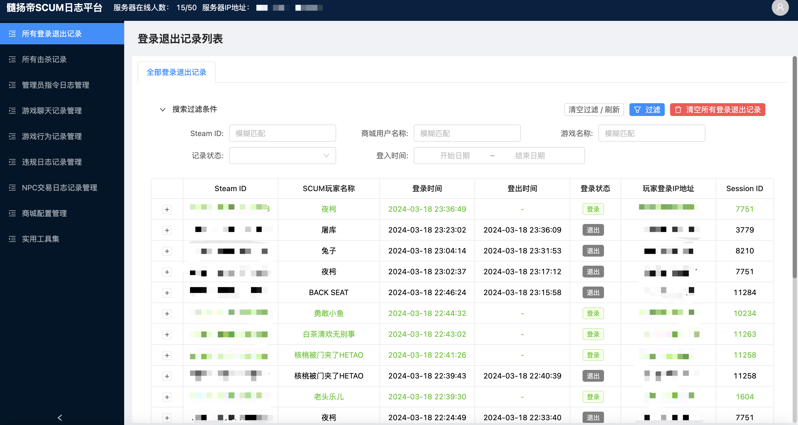
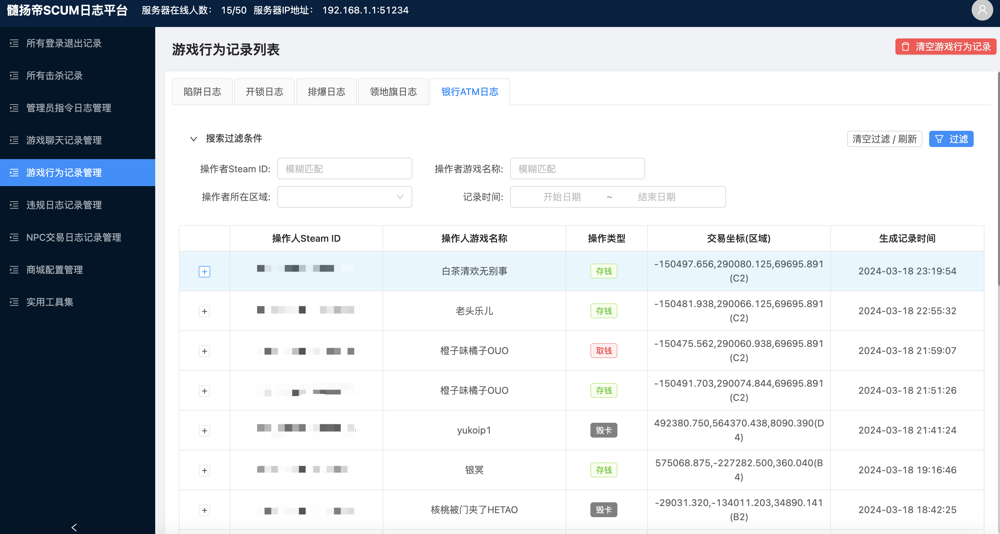
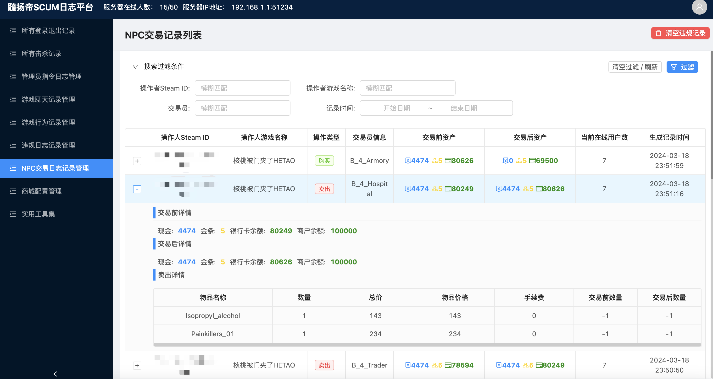
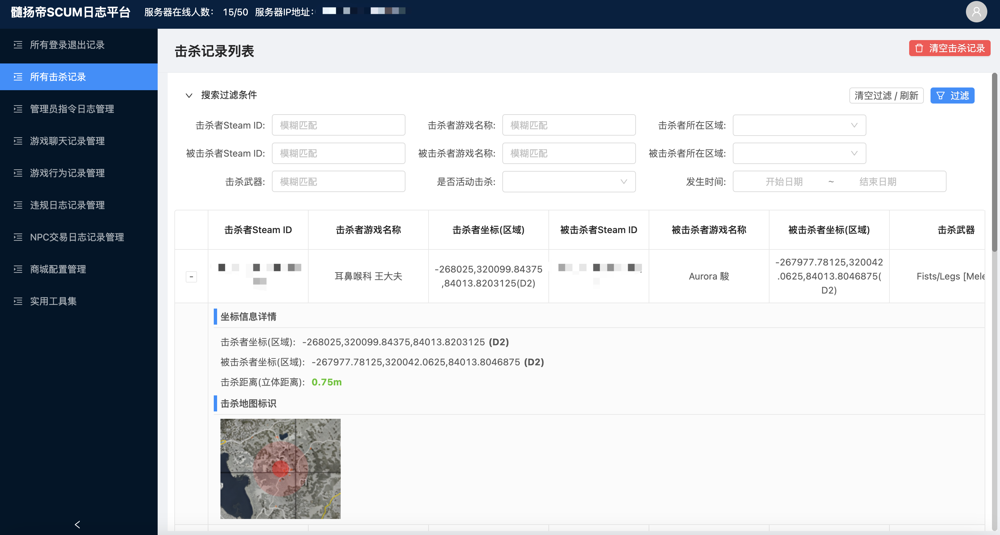
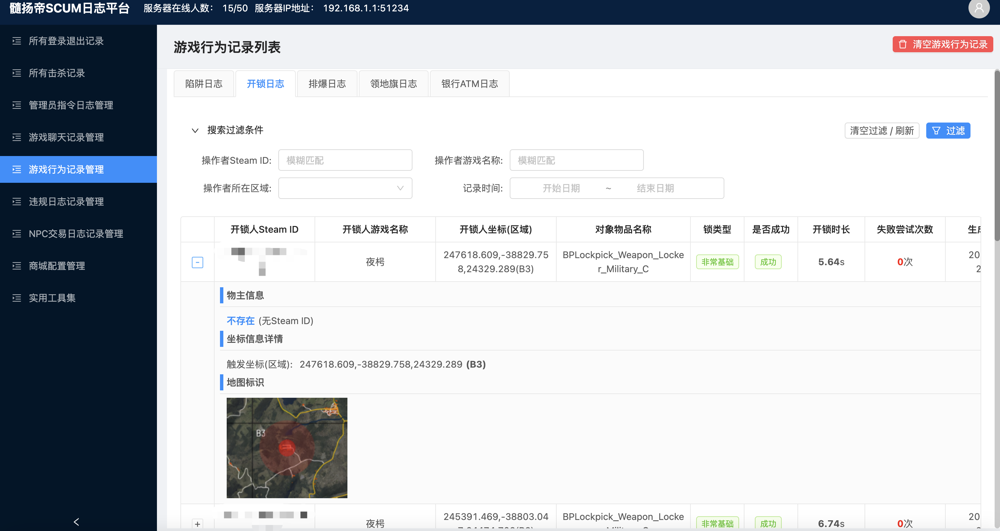
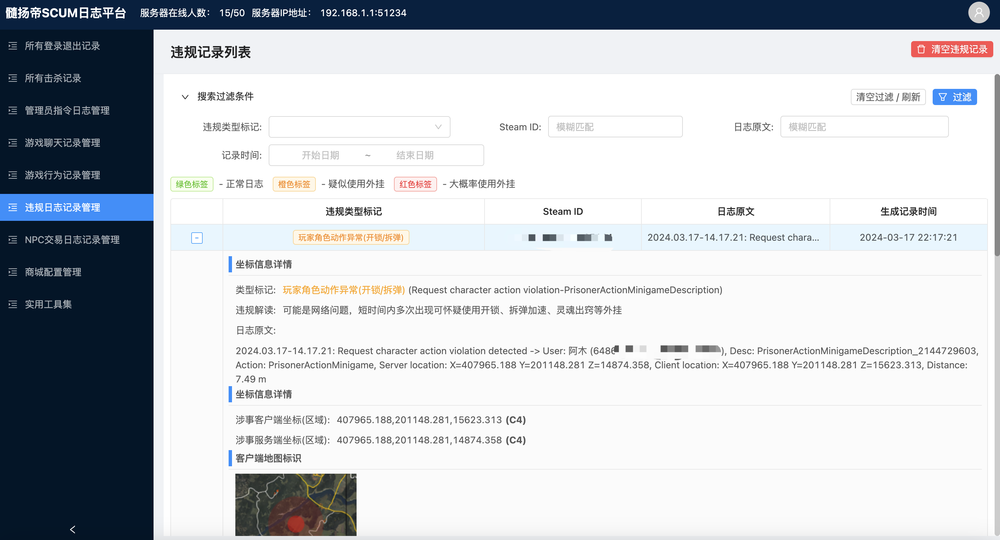
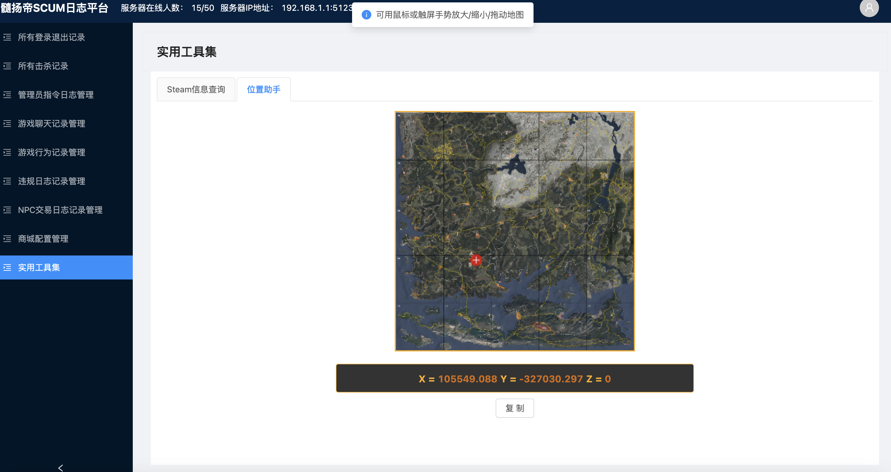
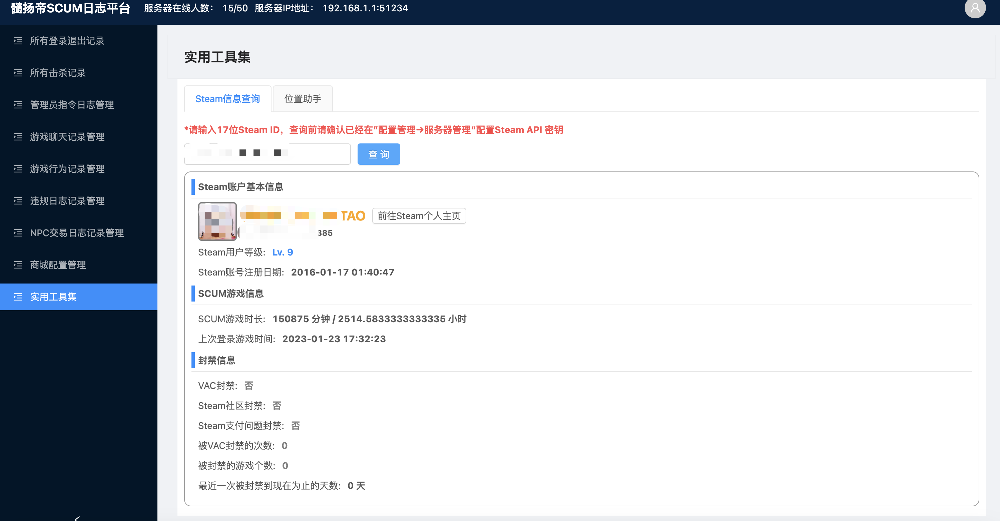

# suiyangdi-scum-game-log-platform
髓扬帝SCUM游戏服务器日志平台，免费开源给各位服主使用，终结SCUM日志工具收费的时代。与其使用付费又受人控制的日志工具，为何不用免费的呢？
Open source for SCUM game players / server holders

视频教程地址：[https://www.bilibili.com/video/BV1Xr421t7u1/](https://www.bilibili.com/video/BV1Xr421t7u1/)

更多SCUM等生存游戏相关的工具教程请关注B站账号 [SCUM商城髓扬帝](https://space.bilibili.com/2052979320/channel/seriesdetail?sid=4023505)
## 功能介绍
1. **日志查看** 可以查看常见的登陆/击杀/管理员指令/服务器聊天/玩家行为（撬锁，转账，埋雷，拆家等）/npc商人交易/违规日志，服务器IP地址，在线人数等。支持g-portal/nitrado(非实时)/gghost/pingperfect等常见运营商的SCUM服务器

2. **坐标定位** 所有附带坐标的日志，比如说登陆击杀，撬锁等，都使用游戏地图精确展示，还可以使用内置小工具快速查询某个点的地图坐标

3. **Steam账号情报查询** 自带小工具，可以查询特定玩家Steam ID的账号情况，游戏时长，封禁记录等

## 安装前准备
本日志平台支持在Windows Server平台或者Linux平台进行部署，因为日志平台使用到Steam API，被中国大陆屏蔽，也需要链接游戏服务器的FTP/SFTP，为了更好的使用体验，需要外网访问的情况下，建议租用价格便宜的香港VPS进行部署，不需要高防等额外要求的话平均价格几十CNY一个月即可。为了各位萌新服主也能看懂并部署日志平台，以下内容以绝大部分人较为熟悉的Windows Server平台架设日志工具为例去介绍。
## 需要在服务器安装的依赖
|名称|版本号|说明|下载地址|
| :------------ | :------------ | :------------ | :------------ |
|**NodeJS**|12.14.1|日志服务架构|[https://nodejs.org/dist/v12.14.1/node-v12.14.1-x64.msi](https://nodejs.org/dist/v12.14.1/node-v12.14.1-x64.msi)|
|**MySQL**|5.7.32|数据库相关|[https://downloads.mysql.com/archives/get/p/25/file/mysql-installer-community-5.7.32.0.msi](https://downloads.mysql.com/archives/get/p/25/file/mysql-installer-community-5.7.32.0.msi)|
|**Redis**|3.2.100|数据库相关|[https://github.com/microsoftarchive/redis/releases/download/win-3.2.100/Redis-x64-3.2.100.msi](https://github.com/microsoftarchive/redis/releases/download/win-3.2.100/Redis-x64-3.2.100.msi)|
|**.NET Framework**|4.5.2|运行MySQL所需依赖|[https://www.microsoft.com/en-us/download/details.aspx?id=42642](https://www.microsoft.com/en-us/download/details.aspx?id=42642)|
|**Navicat**|16.3.8|管理数据库的图形化界面|[http://www.wodown.com/soft/22453.html](http://www.wodown.com/soft/22453.html)|

## 基本部署步骤
1. 按顺序安装以上依赖
2. 设置MySQL端口，密码（安装时设置）和Redis端口，密码（在配置文件中设置）
3. 替换Mysql和Redis配置文件，并重启Mysql和Redis服务
4. 使用Navicat创建字符集为`utf8mb4/utf8mb4_bin`的MySQL数据库，并使用其中的还原数据库功能导入模板数据库
5. 修改和填入`.env`中的`production.env`文件中的配置(MySQL和Redis数据库端口，密码，数据库名，日志工具访问端口，管理员账号信息等)
6. Windows高级防火墙中的入站规则放行配置过的日志工具端口以允许公网访问
7. 以管理员身份运行命令提示符，定位到日志工具解压目录中带有`package.json`的目录，运行`npm i`安装服务依赖
8. 运行`npm run start:prod-multi`或运行根目录的`start-normal.bat`启动日志工具，打开服务器本地浏览器访问`http://localhost:端口号/admin`测试日志工具是否可以访问，并配置SCUM服务器信息
9. 重启日志工具，开始使用
## 法律声明
髓扬帝日志工具已申请中国/日本的计算机软件著作权，本工具供各位SCUM服主免费使用，禁止其他友商利用免费工具来盈利，实施以上行为将违反法律并可能触犯中国和日本国的刑法。其他服主发现有人进行类似的行为可以直接联系髓扬帝本人(QQ 1065617282)或者浙江之星律师事务所进行举报

**声援 [996.ICU](https://github.com/996icu/996.ICU) 项目**
